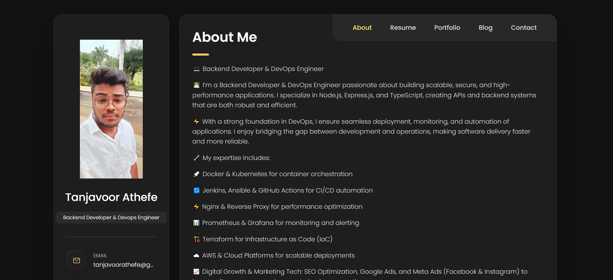

# Personal Portfolio Website

A simple and responsive portfolio website showcasing my skills, projects, and contact information.

## 📸 Screenshot

Here’s a preview of my portfolio website:

## 📂 Project Structure

/project-folder  
│── index.html # Main portfolio page  
│── style.css # Styling for the portfolio  
│── script.js # (Optional) For interactivity  
│── /images # All project & skill icons  
│ ├── ecommerce.png  
│ ├── social.png  
│ ├── twitter.png  
│ ├── jenkins.png  
│ ├── github.png  
│ ├── kubernetes.png  
│ ├── ec2.png  
│ ├── innoedge.png  
│ ├── Atif-portfolio.png # Screenshot added here  
│── README.md # Project documentation

## 🚀 Features

- Responsive portfolio design
- About Me section
- Skills section with icons (Jenkins, GitHub, Kubernetes, AWS EC2, etc.)
- Projects showcase (E-commerce, Social Media, Twitter Clone, InnoEdge)
- Contact information

## 🛠️ Technologies Used

- HTML5
- CSS3
- JavaScript

## 🔗 Live Demo

👉 [View Portfolio](https://portfolio.tanjavoorathefe.in/)

## 📬 Contact

- Email: **tanjavoorathefe@gmail.com**
- LinkedIn: [Athefe](https://www.linkedin.com/in/athefe/)
- GitHub: [athefe-tanjavoor](https://github.com/athefe-tanjavoor)

## 🚀 How to Run

1. Clone this repository:  
   git clone https://github.com/athefe-tanjavoor/Atif-Portfolio-Website.git

2. Open index.html in your browser.

📄 License
This project is licensed under the MIT License.

✨ Built with ❤️ by Athefe

⚡ Now your README has **stars, forks, issues, and license badges** — makes it look polished and GitHub-trending style.
